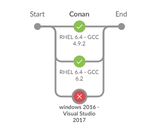
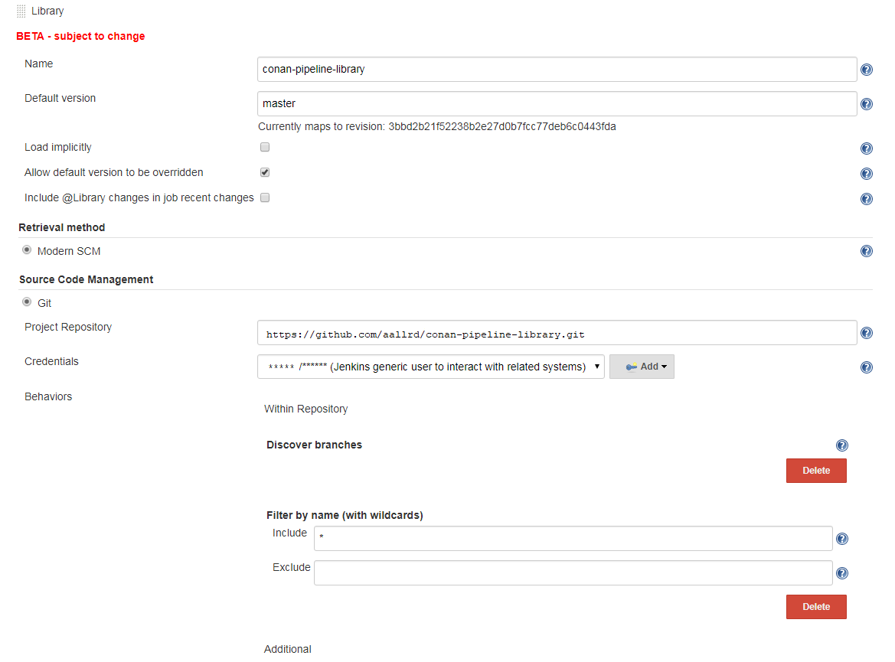
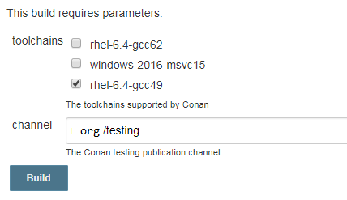

# Conan Pipeline Library

## Introduction

The **Conan Pipeline Library** is aimed at simplifying the Conan continuous integration workflow in Jenkins.

It allows you to build your Conan project with several toolchains easily and out of the box, with a minimal Jenkinsfile pipeline.



## Configuration

You need to configure the **Conan Pipeline Library** on your Jenkins master.

It only needs to be done once, and it will be directly usable from all your pipelines after that.

The configuration is available under `Manage Jenkins` » `Configure System` » `Global Pipeline Libraries` » `Add`:
- Name: `conan-pipeline-library`
- Default version: `master`
- Retrieval method: `Modern SCM`
- Git: `https://github.com/aallrd/conan-pipeline-library.git`
- Filter by name (with wildcards): `Include *`



## Usage

In your Jenkinsfile, you simply need to have the below code:

    #!/usr/bin/env groovy
    @Library('conan-pipeline-library') _
    conan { }

Once the pipeline is saved and loaded, your job will be parameterized with the below available options:
- **toolchains**: A checkbox list of the available and certified toolchains you can select to build with. A default toolchain is always selected, but you can select more than one or all of them.
- **channel**: The Conan publication channel to use to publish the created packages. The default one is `org/testing`.

Once loaded, the job will be automatically parameterized to run every day at midnight with all the configured toolchains.



## Available toolchains

The available toolchains are:

    compilers:
        gcc:
        version: ["4.9.2", "6.3.1", "7.3.1"]
        Visual Studio:
        version: ["15.5.0"]

## Settings

You can configure the Conan Pipeline Library by settings the below properties in the conan closure. These settings will override the Jenkins job parameters.

- **channel**:  Hardcoded Conan channel to publish on.
- **verbose**: The CPL will output debugging information.
- **git**: The git repository containing the conanfile to build.
- **compilers**: The compilers to build with. It supports the [semantic versioning](#semantic-versioning) specification for the versions restriction.

```
#!/usr/bin/env groovy
@Library('conan-pipeline-library') _
conan {
    channel = "org/dev"
    verbose = "True"
    git = [url: "https://github.com/user/conan-project.git", branch: "awesome-feature"]
    compilers = [
        "gcc": "!(6.3)",
        "Visual Studio": "*"
    ]
}
```

### Semantic Versioning

The **compilers** setting supports the [semantic versioning specification](https://semver.org/) for restricting compilers versions.

Below are examples of some common use cases for specifying version restrictions:

* Wildcard Ranges (`*`|`X`|`x`) - `1.*` which is equivalent to `>=1.0.0 & <2.0.0`
* Tilde Ranges (`~`) - `~1.5` which is equivalent to `>=1.5.0 & <1.6.0`
* Hyphen Ranges (`-`) - `1.0-2.0` which is equivalent to `>=1.0.0 & <=2.0.0`
* Caret Ranges (`^`) - `^0.2.3` which is equivalent to `>=0.2.3 & <0.3.0`
* Partial Version Ranges - `1` which is equivalent to `1.X` or `>=1.0.0 & <2.0.0`
* Negation operator - `!(1.x)` which is equivalent to `<1.0.0 & >=2.0.0`
* Parenthesized expressions - `~1.3 | (1.4.* & !=1.4.5) | ~2`

If the **compilers** setting is not configured, the build will be launched by default on all the available toolchains.

## Known issues

- The Jenkins job parameters are not available at first after I defined my pipeline

This is a happening because the pipeline has only been defined and not loaded yet, so the Job parameters definitions from the shared library have not been applied to the job yet.

**Fix**: A simple fix is to start build of the job and cancel it immediately. The next build request will display the correct parameters.

- I modified the toolchains.json resource file and the toolchains list is now empty in the `Build with Parameters` section in Jenkins

This could be happening because the generated toolchain selection script has changed because of your changes and is pending security approval by the Jenkins Script Security plugin.

**Fix**: On the Jenkins menu `Manage Jenkins` » `In-process Script Approval`, approve the modified script.
